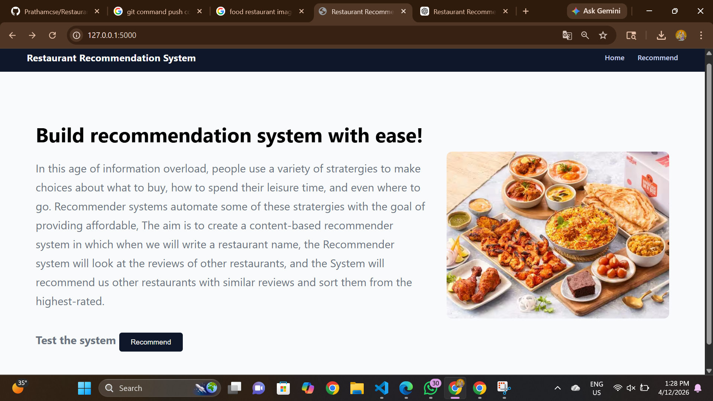
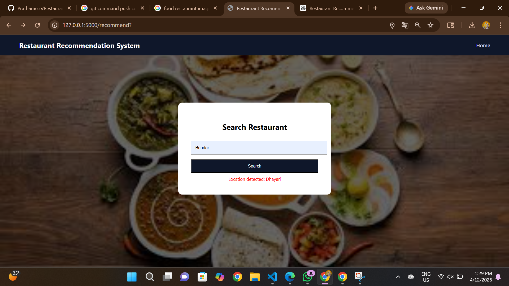
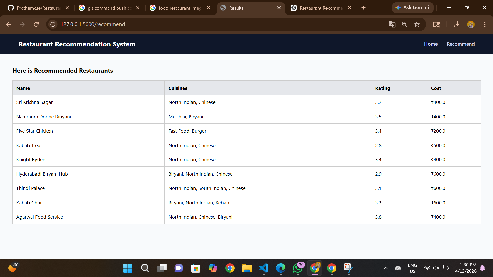
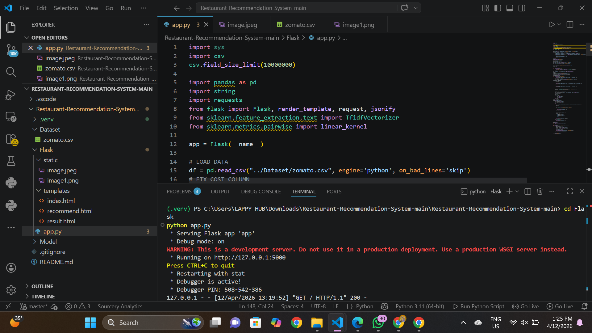

nul not found
# Restaurant-Recommendation-System

A machine learning-based web application that recommends restaurants based on user input using NLP and similarity techniques.

---

## Project Overview

This project helps users discover restaurants similar to their preferences by analyzing restaurant reviews and features.

The system uses:
- Text processing (NLP)
- TF-IDF Vectorization
- Cosine Similarity

---

## Features

-  Search restaurant by name
-  Get similar restaurant recommendations
-  View ratings and cuisines
-  View approximate cost for two people
-  (Optional) Location-based filtering
-  Simple and clean web interface using Flask

---

## Tech Stack

- Python
- Flask
- Pandas
- Scikit-learn
- HTML, CSS

---

## Project Output Screenshots
   
   ### Home Page
   
   ### Search Page
   
   ### Recommendation Page
   
   ### Ratings Page
   
   ### terminal output

